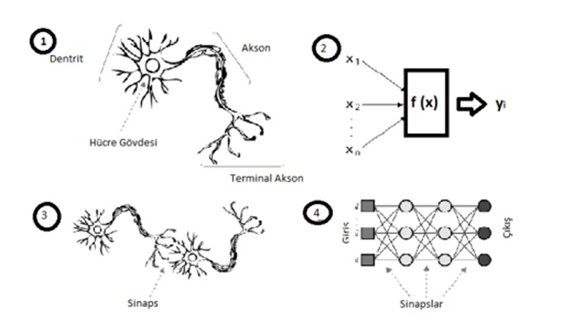
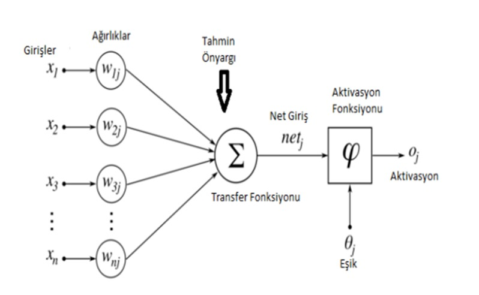
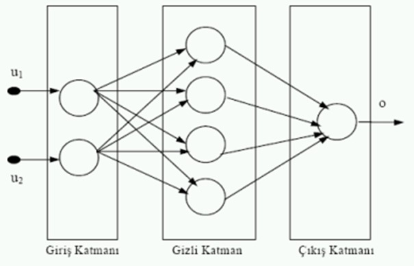
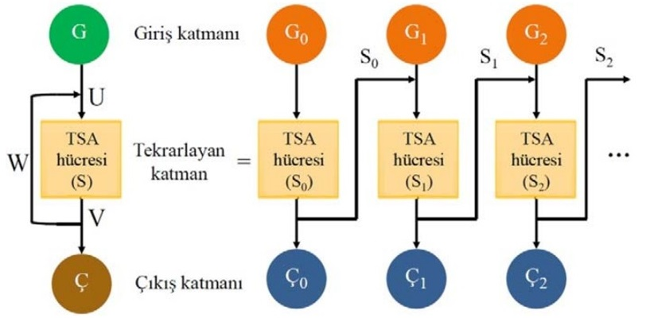
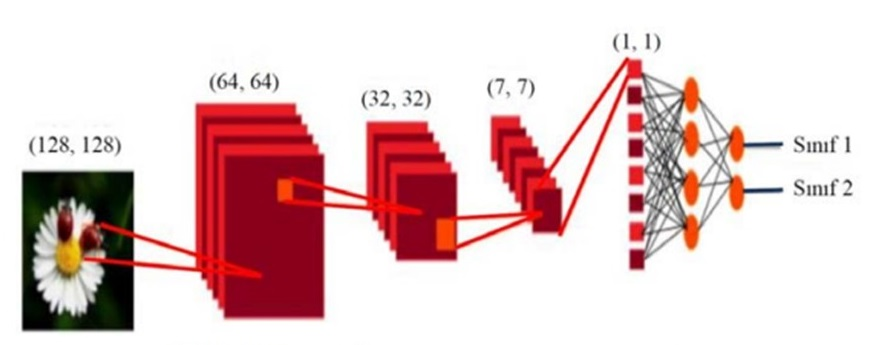
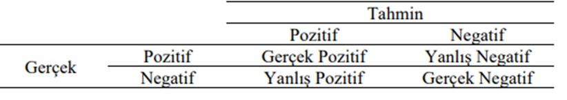

# YÖNTEM {#math-sci}

```{r,message=FALSE,echo=FALSE,include=FALSE}
library(kableExtra)
```

  Bu bölümde uygulama kısmında kullanılmış olan makine öğrenmesi algoritmalarına değinilmiştir.Bu yöntemler 3 sınıfta kategorize edilmiştir;Geleneksel yöntemler, Ağaç yöntemleri ve Sinir Ağları yöntemleri.

## Geleneksel Yöntemler 

### K En Yakın Komşular Algoritması

  K En Yakın Komşular algoritması makine öğrenim algoritmaları içerisinde en çok bilinen ve kullanılan algoritmalardan biridir. Seçilen bir özelliğin kendine en yakın olan özellikle arasındaki yakınlığı kullanarak sınıflandırma yapılır.Burada bulunan K değeri örnek olarak 3 veya 5 gibi bir sayı ile ifade edilebilir.Çalışma şekline baktığımızda, tanımlanan verilere göre yeni bir tanımlanması gereken nesne geldiğinde öncelikle K değerine bakılır.Burada eşitlik olmaması için genellikle K sayısı tek sayı olarak seçilir.Yeni gelen veri ile diğer veriler arasındaki mesafeler hesaplanırken Kosinüs, Öklid ya da Manhattan uzaklığı gibi yöntemler kullanılır[@dolgun2009veri].

#### K En Yakın Komşular algoritmasında temel olarak aşağıdaki adımlar gerçekleştirilir:

- K değerinin belirlenmesi. 
- Tüm öğrenme örnekleri ile olan uzaklığının hesaplanması. 
- Minimum uzaklığa göre sıralama işleminin yapılması. 
- Ait oldukları sınıf değerlerinin bulunması.
- Değeri baskın olan sınıfın seçilmesi


  K En Yakın Komşular algoritması tanımlı gözlemlerin sınıflandırılmasına ve regresyon yapılabilmesine olanak sağlamaktadır.K En Yakın Komşular algoritması basitliği ve kolay uygulanabilirliği nedeniyle yaygın kullanılan bir algoritmadır.Bu özelliğinden ötürü sıkça kullanılmaktadır.Birçok algoritma verilerin istatistiksel dağılımı ile ilgili olarak bazı varsayımları gerektirmesine rağmen K En Yakın Komşular kullanılacağı durumlarda böyle bir varsayıma gereksinim olmamaktadır.K En Yakın Komşular algoritmasının tahmin yapabilmesi için eğitimi hızlı olmaktadır[@lantz2019machine].


<!-- #### K En Yakın Komşular algoritması aktivite tanımadaki yeri  -->
  İnsan aktivitesi tanıma konusunda şimdiye kadar pek çok çalışma yapılmıştır ve yapılmaya da devam edilmektedir.Tanınacak aktiviteye bağlı olarak aktiviteler basit veya karmaşık aktiviteler olarak iki sınıfa ayrılabilir.Basit aktiviteler, küçük bir frekans aralığında bileşenler içeren sinyallerle temsil edilebilirken karmaşık aktiviteler, farklı frekans bileşenlerine sahip olan ve kendini tekrar eden sinyaller ile temsil edilmesi zor olan aktiviteler olarak tanımlanabilir.Bu aktivitelerin tanınmasında farklı makine öğrenmesi algoritmaları kullanılmıştır.Paul ve George, akıllı telefonlardaki sensörlerden elde edilen verileri kullanarak K En Yakın Komşular algoritmasında insan aktivite tanımlama çalışması yapmışlardır[@paul2015effective].Sağbaş ve Ballı kullanıcıların yazma davranışlarını; yazma hızı, silme sıklığı gibi bilgilere ek olarak ivmeölçer ve jiroskop gibi hareket algılayıcılarından elde edilen veriler ile birlikte incelemiştir[@saugbacs2017akilli].Algılayıcı verileri telefonun duruşu yazma anında sergilenen durum hakkında önemli bilgiler vermektedir.2 sınıflı stres tespitinde
K En Yakın Komşular ile %87.56 sınıflandırma doğruluğu elde edilmiştir.Çalışmaya 35 erkek, 11 kadın olmak üzere 46 gönüllü katılmıştır. Gerçek referans değer için ise 5 seviyeli öz değerlendirme anketi kullanılmıştır[@saugbacs2021akilli].


### Destek Vektör Makinesi  
  Destek Vektör Makineleri genellikle sınıflandırma problemlerinde kullanılan gözetimli öğrenme yöntemlerinden biridir.Bir düzlem üzerine yerleştirilmiş noktaları ayırmak için bir doğru çizer.Bu doğrunun iki sınıf noktaları için de maksimum uzaklıkta olmasını amaçlar.Karmaşık ama küçük ve orta ölçekteki veri setleri için uygundur.

  Destek vektör makinesi, sınıflandırma ve regresyon analizi için kullanılan verileri analiz eden ilişkili öğrenme algoritmalarına sahip denetimli öğrenme modelleridir.Eldeki verilerden yeni kalıpları tanımlamak için büyük miktarda veriyi analiz ederler.Destek Vektör Makinesi, aşağıdaki resimde gösterildiği gibi bir veri kümesini en iyi iki sınıfa ayıran bir hiper düzlem bulma amacı ile oluşturulur.

#### Hiper düzlem nedir
 Basit bir örnek olarak, yalnızca iki özelliğe sahip bir sınıflandırma görevi için, bir hiper düzlemi bir veri kümesini doğrusal olarak ayıran ve sınıflandıran bir çizgi olarak düşünebiliriz.Şöyle de düşünebiliriz, veri noktalarımız hiper düzlemden ne kadar uzak olursa, doğru sınıflandırıldıklarından o kadar emin oluruz.Bu nedenle, veri noktalarımızın doğrulara hiper düzlemden olabildiğince uzakta olmasını istiyoruz.Dolayısıyla, yeni test verileri eklendiğinde, iniş yapan hiper düzlemin herhangi bir tarafı, ona atadığımız sınıfa karar verecektir.
 
\ 

Destek Vektör Makinesi algoritmasının aktivite tanımadaki yeri;


```{r,include=TRUE,message=FALSE,echo=FALSE}
yazar_yıl <- c("Kim ve Choi,2012","Ciman ve Wac,2018","Sağbaş vd.,2020","Lee vd.,2012")
veri_kaynagi <- c("Dokunmatik Panel,İvmeölçer,Jiroskop","Dokunma İstatistiği,Uygulama kullanımı,Aktivite,Işık,Ekran açma/kapama","Yazma Karakteristiği,İvmeölçer,Jiroskop","Yazma karakteristiği,Konum,Hava durumu,Işık")
aktivite <- c("Evet(Oturuyormu?,Ayaktamı?)","Evet","Hayır","Hayır")
basari_metrigi <- c("F ölçütü","F ölçütü","Doğruluk oranı","Doğruluk oranı")
basari_degeri <- c("%82","%88","%87.56","%67.52")
yöntem <- c("Karar Ağacı","K En Yakın Komşular","K En Yakın Komşular","Bayes Ağları")

df <- data.frame(yazar_yıl,veri_kaynagi,aktivite,basari_metrigi,basari_degeri,yöntem)

# df %>%
#   kbl() %>%
#   kable_styling(full_width = F, html_font = "Cambria",latex_options = "scale_down")


kable(df, "latex",caption = "Destek Vektör Makinesinin Aktivite Tanımadaki Yeri \\label{tab:svmaktivite}") %>% kable_styling(full_width = F, html_font = "Cambria",latex_options = "scale_down") %>%
  column_spec(2, width = "11em")
```

## Ağaç Yöntemleri

### Rassal Ormanlar (Random Forest) 
  2000’li yılların başında Breiman tarafından tasarlanan rassal ormanlar algoritması verileri işlemek için şu anda mevcut olan en başarılı yöntemler arasında yer alır.Bu denetimli öğrenme yöntemi basit ama etkili olan “böl ve fethet” ilkesine dayanır.Verinin her bir örneklem fraksiyonu üzerinde ağaç tahmincisi kurup daha sonra bu tahmincilerin ortalamalarını kullanarak tahminde bulunur.Rassal ormanlar sınıflandırma ve regresyon problemleri için kullanılır.Rassal ormanları popüler bir makine öğrenmesi algoritması yapan özelliklerinden bir diğeri ise ayarlanması gereken az sayıda parametreye sahip olması ve tahmin problemlerinde çok geniş kullanım alanına sahip olmasıdır.Değişken sayısının gözlem sayısından fazla olduğu verilerde çok iyi performans göstermesiyle bilinen bir algoritmadır[@biau2016random]. 


#### Algoritma
  Algoritmanın genel çerçevesi verilen P boyutlu bir X vektörü ile P boyutlu Y vektörünün nonparametrik regresyon tahminidir. Regresyon fonksiyonu = $m(x) = E[Y | X = x]$ $D_{n} = ((X_{1},Y_{1}),...,(X_{n},Y_{n}))$ birbirinden bağımsız dağılan eşleştirilmiş gözlemler olsun.Amacımız $D_{n}$’i kullanarak M’in fonksiyonu olan $M_{n} : X \to R$ ‘i tahmin etmektir. $M_{n}$ regresyon fonksiyonu eğer $E[M_{n}(X) - M(X)]^{2} \to 0 , n \to \infty$ tutarlıdır.Rassal orman rassallaştırılmış M tane regresyon ağacını içeren bir tahmin edicidir.Verilen bir X noktası için J’nci ağaçtaki tahmin değeri matematiksel olarak aşağıdaki gibi ifade edilir.

$m_{n}(x;\Theta_{j},D_{n}) , \Theta_{1},...,\Theta_{M}$ rassal değişkenleri $D_{n}$'den bağımsızdır.$\Theta$ Dallandırılıcak her bir ağaç için yeniden örnekleme yapmak için ve bölünme için ardışık yönler belirlemek için kullanılır.


$$m_{n}(x;\Theta_{j},D_{n}) = \sum_{x \in D_{n}^{*}(\Theta_{j})}^{} \frac{X_{i} \in A_{n}(x;\Theta{j},D_{n})Y_{i}}{N_{n}(x;\Theta_{j},D_{n})}$$


$D_{n}^{*}(\Theta_{j})$ ağaç yapımından önce seçilen verideki noktaları ifade eder.


$A_{n}(x;\Theta_{j},D_{n})$ x'i içeren hücre ve $N_{n}(x;\Theta_{j},D_{n}$ ise $A_{n}(x;\Theta_{j},D_{n})$ hücresinin içine düşen nokta sayısını ifade eder.


Sonlu boyutlu rassal ağaç tahmini:
$$m_{M,n}(x;\Theta_{1},...,\Theta_{M},D_{n}) = \frac{1}{M} \sum_{j=1}^{M} m_{n}(x;\Theta_{j},D_{n}))$$


### XGBoost
  Rassal orman algoritmasına benzeyen bu algoritma karar ağaçları ile çalışmaktadır.XGBoost algoritması hız ve performans için tasarlanmış gradyan artırılmış karar ağaçlarının bir uygulamasıdır.Boosting(artırma), mevcut ağaçların yaptığı hataları düzeltmek için yeni ağaçların eklendiği bir grup tekniktir.
Bu yöntemin çalışma mantığına göre; verideki her bir değeri analiz etmek yerine onları parçalara ayırma işlemi uygulanmaktadır. Bu şekilde küçük parçalar üzerinden daha iyi tahminleme yapması beklenmektedir[@yangin2019xgboost].

  Gradyan Artırım Algoritması (Gradient Boosting):Bu algoritma, makine öğrenmesinde tahminleri  bağımsız  yapmak  yerine  sırayla yapan  bir  çeşit  topluluk  algoritmasıdır.Amaç  zayıf tahminleri iterasyonlarla kademeli olarak güçlü tahminlere dönüştürmektir.Gradyan Artırma Algoritmasında ilk iterasyonda tahminleri üreten bir $y_{i}^{p}$ ve “Loss” fonksiyonları birleştirilir ve tekrar tahminler ile hedefler arasındaki fark hesaplanır.Böylece sürekli üstüne ekleyerek $y_{i}^{p}$ fonksiyonunun başarısı arttırılmaya ve tahminler ile hedefler arasındaki fark sıfıra indirilmeye çalışılır.

$$ LOSS = MSE = \sum{(y_{i}-y_{i}^{p})^2} $$
Burada $y_{i}$ hedef değer $y_{i}^{p}$ i. tahmin değeri $L(y_{i},y_{i}^{p})$ kayıp fonksiyonu ve $\alpha$ ise öğrenme oranıdır.Tahminleri, kayıp fonksiyonu minimum olacak şekilde elde etmek gereklidir.Gradyan iniş kullanarak  tahminler  öğrenme  oranına  göre  iterasyonlarda  güncellenir  ve  kayıp  fonksiyonunun minimum değerleri bulunur.

$$ y_{i}^{p} = y_{i}^{p} + \alpha * \delta \sum{\frac{(y_{i} - y_{i}^{p})}{\delta y_{i}^{p}}}$$
$$ y_{i}^{p} = y_{i}^{p} - \alpha * 2 * \sum{(y_{i} - y_{i}^{p})}$$

Böylece  artıkların  toplamı  sıfıra  yakın  olması  yani  tahmin  edilen  değerler  gerçek  değerlere olabildiğince yaklaşması arzu edilen durumdur.


## Sinir Ağları Yöntemleri
  İnsan beyninin üstün özelliklerini ve beynin nörofiziksel yapısından esinlenerek matematiksel modeli çıkarılmaya çalışılmıştır. Yapay sinir ağları, insan beyninin öğrenme yolunu taklit ederek beynin öğrenme, hatırlama, genelleme yapma yolu ile topladığı verilerden yeni veri üretebilme gibi temel işlevlerin gerçekleştirildiği bilgisayar yazılımlarıdır[@ozturk2018yapay].

```{r ysa, fig.align='center',echo=FALSE, out.width="100%",out.height="27%" , fig.cap="Biyolojik sinir hücresi ve yapay sinir ağı"}

```

[@maltarollo2013applications]

Biyolojik sinir hücresi ve yapay sinir ağı benzetimleri \@ref(fig:ysa).’de verilmiştir.YSA, yapay sinir hücrelerinin birbirleri ile çeşitli şekillerde bağlanmasından oluşur ve genellikle katmanlar halinde düzenlenir.İnsan beynine iki şekilde benzerlik göstermektedir:

- Bilgi, öğrenme süreci yoluyla ağ tarafından elde edilir.
- Sinaptik ağırlıklar olarak bilinen nöronlar arası bağlantı kuvvetlerini, bilgiyi depolamak için kullanır

```{r ysa2, fig.align='center',echo=FALSE, out.width="100%",out.height="27%" , fig.cap="Yapay sinir hücresi"}

```

[@ozturk2018yapay]

\@ref(fig:ysa2). ‘de görüldüğü gibi bir hücreye n adet veri girişi yapılmıştır.Bu girdilere ait ağırlıklar ile girilen veriler çarpılıp toplanması ile elde edilen transfer fonksiyonu, tranfer fonksiyonundan gelen değerin belirli bir aralığa normalize edildiği aktivasyon fonksiyonu ve aktivasyondan oluşur.
Çok katmanlı yapay sinir ağlarına bakıldığında temel olarak 3 katmandan meydana gelir;

- Girdi Katmanı (Input Layer) 
- Gizli, Ara Katmanlar (Hidden Layers) 
- Çıktı Katmanı (Output Layer)


Yapay Sinir Ağları uygulamaları en çok tahmin, sınıflandırma, veri ilişkilendirme, veri yorumlama ve veri filtreleme işlemlerinde kullanılmaktadır[@augyar2015yapay].

Bu prensipte çalışan yapay sinir ağları girdi değerinden çıktıları tahmin etme üzerine çalışır, örneğin altın ons fiyatının tahmini. 

Bu doğrultuda kodlanan yapay ağlar toplanan veriler arasından en işe yarayan verileri kullanır.

- Sınıflandırma Girdi değerlerini sınıflandırarak sistemin daha hızlı sonuca varmasına etkide bulunur. 

Önceden eğitilen ağ girdilerini analiz eder, bir olay hakkında bu girdiler sayesinde yeni yorumlamalar yapabilmektedir.

Öğrendiği bilgilerle konuları ilişkilendirir ve bunun sonucunda ortaya çıkan eksik bilgileri tamamlar[@ozturk2018yapay].

  Bir yapay sinir ağının yapısı ve sinir hücrelerinin sayısı değişiklik göstermelerine rağmen, yapay sinir ağının oluşumu için kabul görmüş herhangi bir kural bulunmamaktadır.Gerekli gizli katman sayısından az gizli katmana sahip yapay sinir ağları komplike fonksiyonların çözümünde yetersiz kalırken, çok fazla gizli katmana sahip yapay sinir ağları ise istenmeyen kararsızlıklarla karşılaşmaktadır.Gizli katman sayısı belirlendikten sonra karşılaşılan problem ise her bir tabakada kaç tane nöronun yer alacağına karar vermede karşımıza çıkmaktadır.Girdi katmanı için bir sorun bulunmamaktadır.Bu sayı sistem içerisindeki girdilerin sayısına eşittir.Aynı şekilde, çıktı katmanı da istenilen çıktı sayısıyla belirlenebilmektedir.Esas sorun, gizli katmanlarda nöron sayısını belirlemektir.Geleneksel matris algoritması, matris boyutlarının ya girdi sayısına ya da çıktı sayısına eşit olması gerektiğini söylemektedir.Ne yazık ki, gizli katmanda en verimli şekilde kaç tane nöronun bulunacağı konusunda herhangi bir matematiksel test bulunmamaktadır.Deneme ve yanılma yöntemi uygulanarak karar verilmelidir[@detienne2003neural].


```{r ysa3, fig.align='center',echo=FALSE, out.width="100%",out.height="27%" , fig.cap="İleri beslemeli sinir ağı yapısı"}

```

[@firat2004aski]

YSA, hücrelerin bağlanma biçimlerine göre “ileri beslemeli” ve “geri beslemeli” olmak üzere iki mimari yapı altında sınıflandırılabilmektedir

#### İleri beslemeli ağlar
  Verilerin sadece girdi birimlerinden çıktı birimlerine ileri doğru aktığı ağ yapısıdır.Bu yapıda nöronlar katmanlar şeklinde düzenlenir.Bir katmandaki nöronların çıkışları bir sonraki katmana ağırlıklar üzerinden giriş olarak verilir.Aynı katmandaki nöronlar arasında veya bir önceki katmana bağlantı yani geri besleme çevrimi yoktur.Uygulamalarda genellikle ileri beslemeli ağların tercih edildiği görülmektedir[@asilkan2009ikinci]. 

#### Geri beslemeli ağlar
  Veri akışının sadece ileriye doğru değil geriye doğru da olabileceği ağ yapısıdır.Bu yapıda en az bir tane geri besleme çevirimi bulunur.Geri besleme, aynı katmandaki hücreler arasında olabileceği gibi farklı katmanlardaki nöronlar arasında da olabilir[@asilkan2009ikinci]. 

  İşlem sürecinde toplama ve aktivasyon adlarında iki fonksiyon yer almaktadır.
Toplama (Birleştirme) Fonksiyonu: Yapay sinir hücresine gelen girdilerin kendilerine ait ağırlıklarla çarpıldıktan sonra birleştirilmesi işlemini gerçekleştiren fonksiyondur.Bu fonksiyon, adından da anlaşılacağı gibi, genelde toplama işlemini kullanmakla birlikte farklı işlemleri de kullanabilir.Hatta araştırmacının kendi kurduğu işlemi de kullanması mümkündür.Toplama fonksiyonunda kullanılan işlem, genellikle seçilen ağ mimarisine de bağlıdır.En sık kullanılan fonksiyonlar şunlardır; Toplama, çarpım, maksimum, minimum, çoğunluk, kümülatif toplamdır[@asilkan2009ikinci]. 

  Yapay sinir hücresinin çıktısının büyüklüğünü sınırlandıran fonksiyondur.Bazı kaynaklarda transfer, eşik veya sıkıştırma fonksiyonu olarak da isimlendirilmektedir[@mandic2001recurrent].Bir ağdaki tüm hücrelerin aktivasyon fonksiyonu birbirinden farklı olabilir.Aktivasyon fonksiyonunda doğrusal fonksiyonlar genelde tercih edilmez.Zaman serileri için “Sigmoid”, ikili (binary) değişkenler için “Adım” fonksiyonu önerilmektedir[@tebelskis1995speech].En çok kullanılan aktivasyon fonksiyonları şunlardır: Doğrusal, adım, eşik değer, hiperbolik tanjant, sigmoidtir[@asilkan2009ikinci]. 

  Derin ağlar, görüntü tanıma, nesne tanıma ve doğal dil işleme gibi birçok alanda kullanılmaktadır.Aktivite tanıma alanında derin öğrenme yöntemleri ile son yıllarda çalışmalar yapılmıştır.Bu alanda derin öğrenme yöntemleri kullanmanın en büyük avantajı ham sensör verilerinden saklı kalmış önemli özelliklerin otomatik çıkartılabilmesidir.Aktivite tanıma için sensör verilerinden hangi özelliklerin kullanılacağını belirlemek için bilirkişiye ihtiyaç kalmamaktadır.Derin ağlarla cihaz konumundan ve oryantasyonundan bağımsız özellikler de çıkartılabilmektedir. 

  Derin ağların eğitim süresi çok uzun süreler alabildiği için süreyi kısaltmak adına güçlü donanımların kullanımına ihtiyaç duyulmaktadır.Dolayısıyla derin öğrenme ile eğitimin şu anki mobil cihaz donanımları üzerinde yapılması mümkün değildir.Sadece bilgisayar ortamında eğitilmiş hazır modeller telefon üzerinde gerçek zamanlı aktivite sınıflandırmak için kullanılabilir. 
Derin öğrenme yöntemlerinin her birisinin farklı çalışma prensipleri vardır.İncelenmiş makaleler içerisinde daha çok tercih edilen ağ Konvolüsyonel Sinir Ağları (Convolutional Neural Network) olmuştur.Kullanılan derin öğrenme yöntemleri ve sonuçlar karşılaştırmalı[@iskanderov2019akilli].


### Tekrarlayan Sinir Ağları (Recurrent Neural Network)
TSA, zaman serilerini kullanarak işlemleri gerçekleştiren bir YSA türüdür.İleri beslemeli ağların çalışma mantığından farklı olarak ağın girdi verileri TSA eğitimlerinde kullanılabilmektedir.Geri yayılım (backpropagation) ise YSA'lara benzer olarak gerçekleştirebilmektedir.TSA ağları, aynı yapıya sahip TSA hücrelerinin birbirinden farklı gizli durumlarını işleyen kopyalarının bir araya gelmesi ile oluşmaktadır.Bu kopyalar TSA hücrelerinin gizli olmasına neden olmaktadır.Bu derin mimari modelinin tekrarlayan olarak isimlendirilmesinin sebebi çıktı verilerinin tekrardan girdi verisi olarak kullanılmasıdır [@metin2021insanin;@metin2019insan].

```{r ysa4, fig.align='center',echo=FALSE, out.width="100%",out.height="27%" , fig.cap="TSA‘nın genel yapısı"}

```

\@ref(fig:ysa4) 'de TSA'nın genel yapısı gösterilmektedir[@ecsref2019turkcce].
 
Burada, St değeri ile TSA hücrelerinin t anındaki gizli durumları ifade edilmektedir.Bu yöntem yardımı ile o anki adıma kadar ağa giren tüm girdi verileri üzerinden buradaki t anında işleme alınan Gt durumundaki girdi verisi hesaplanmaktadır.Ayrıca, (t - 1) anındaki mevcut gizli durum ise St-1 değeriyle ifade edilmektedir.Aşağıdaki $S_{t}$ eşitliğinde görülebileceği gibi uygun model oluşturularak buna ait U ve W ağırlık parametreleri kullanılmasıyla St değeri hesaplanmaktadır.

Bu eşitlikteki $f_{a}$ aktivasyon fonksiyonunu ifade etmektedir.Genellikle burada hiperbolik tanjant (tanh) aktivasyon fonksiyonu seçilerek [-1,1] aralığında sonuç üretmektedir[@yang2016multi].

$$ S_{t} = f_{A}(UG_{t}+WS_{t-1})$$
belirtilen hesaplamada normalize işlemi gerçekleştirilmiş softmax fonksiyonu kullanılarak [0,1] değerleri arasında ağın çıktısı  ${Ç_[t]}$ elde edilmektedir.

$$Ç_{t} = softmax(V * S_{t})$$


  YSA‘da girdi verileri tüm katmanlarda kullanıldığından gradyan değeri önceki katmanlara bağımlı biçimde değişmektedir.Geri yayılımın sürekli yenilenmesi sonrasında, hesaplamalardaki değerlerde azalma yaşanması sonucu kaybolan gradyan (vanishing gradient) problemi oluşabilmekte, buna benzer diğer bir durumdaysa 1’den büyük değer alan gradyanlar hesaplanan sonucun büyümesine yol açmaktadırlar.Bu durumda da patlayan gradyan (exploiting gradient) problemi ortaya çıkmaktadır.Oluşan bu problemlerin en aza indirilmesi için, uzun süreli bağımlılıkları da öğrenebilen yapıdaki TSA mimarisinin özel bir tipi olan UKSB hücreleri kullanılmaktadır.Uzun vadeli bağımlılık ve kaybolan gradyan gibi problemlere çözüm için geliştirilmiş olan ve TSA mimarisi göz önüne alındığında daha hızlı ve görece daha basit yapıda olan Kapılı Tekrarlayan Birim (KTB) modelleri de literatürde mevcuttur.Bu mimari bakış açısıyla, unutma kapısı (forget gate), girdi kapısı (input gate) ve çıktı kapıları (output gate) UKSB hücrelerinde bulunmaktadır[@yang2016multi].KTB hücreleri reset kapısı ve güncelleme kapısı (update gate) içermekte, böylece UKSB hücrelerine göre hafızada bir verinin ne kadar uzun süre tutulup, güncel veri ile hafızadaki verinin hangi zaman adımında birleştirileceği gibi olgular belirlenebilmektedir[@yang2016multi].Veri dizileri içerisinde belirli bir önceki (t - 1) ve buna ilişkin sonraki (t + 1) zaman adımlarını işleyebilen çift yönlü işlevsel yapılar da literatürdeki çeşitli çalışmalarda mevcuttur.Çift yönlü işlevsel bir yapıya sahip olarak oluşturulan KTB ve UKSB hücrelerini içeren çeşitli modellerin aynı zamanda ardışık verileri işlemede bazı avantajları da vardır [@schuster1997bidirectional].

### Evrişimli Sinir Ağları (Convolutional Neural Network)
  ESA, görme duyusunun işlevinden faydalanan, görüntüleri alt bölümlere parçalayarak bütün görüntü üzerinde işlem yapan Çok Katmanlı Algılayıcı (ÇKA) türüdür.1988 yılında Yann LeCun’ın öne sürdüğü ve 1998 yılına kadar da üzerinde iyileştirmelerin gerçekleştirildiği ilk ESA ağlarından birisi de LeNet ağıdır[@metin2021novel].LeNet ağında; ÇKA yapısına benzeyen tam bağlı katman (fully connected layer), biriktirme katmanı (pooling layer) ve evrişim katmanı (convolution layer) yer almaktadır[@lecun1998gradient].ESA, veriyi işlerken çeşitli filtreler kullanmakta, bu filtrelerin içerikleri veriden elde edilen öznitelikler olarak otomatik bir biçimde ağ tarafından öğrenilebilmektedir.\@ref(fig:cnn1).’te ESA ağının iki boyutlu (2B) yapıda oluşturulan modeline dair altyapı şematik olarak görülmektedir[@bengio2013representation].ESA modellerinin katmanları incelendiğinde; evrişim katmanı ESA’nın temelini oluşturan dönüşüm katmanıdır.Bu katmanda, belirli ölçeklerdeki filtreler görüntüler üzerinde kaydırılarak öznitelik haritasının (feature map) oluşturulması sağlanır.Biriktirme katmanı; evrişim katmanları arasına eklenen katmandır.Model içerisinde parametre değerlerinin hesaplama miktarını azaltarak aşırı öğrenme (overfitting) nedeniyle ağ'da oluşan ezberlemeyi önler.Bu sayede ağ üzerinde uyumsuz durumların da engellenmesi sağlanmış olur. Düzleştirilmiş (flatten) veriler, tam bağlı katmanda alınarak sinir ağı vasıtasıyla öğrenme işlemi gerçekleştirilmektedir. İşlemler sonrasında belirlenen sınıflara göre dönüşümler gerçekleştirilmektedir.Bazı katmanlardaki sinir düğümlerinin eğitim süresi içerisinde pasif bir duruma getirilmesi ise iletim sönümü (dropout) katmanında gerçekleştirilir.Sadece ve sadece eğitim süresi içerisinde iletim sönümü gerçekleştirilmekte, tüm sinir düğümleriyse test işlemi süresince aktif durumda olmaktadır.


```{r cnn1, fig.align='center',echo=FALSE, out.width="100%",out.height="27%",fig.cap="Evrişimli Sinir Ağları Yapısı"}

```
[@metin2019insan]


Böylece iletim sönümü kullanımıyla; çok fazla ayrıntıya ağ modelinin odaklanması da engellenerek başarım iyileştirilmektedir.Her bir döngü süresince belirli bir oranda farklı sinir düğümleri böylece pasif hale getirilmekte ve aktif haldeki sinir düğümleriyse sürekli değiştirilmektedir[@lecun1998gradient].Ara katmanların doğrusal olmayan biçimde veriyi işlemesinde aktivasyon fonksiyonu olarak doğrultulmuş biçimli doğrusal birim olarak bilinen ReLU (Rectified Linear Unit) içeren bir yapı sıklıkla literatürdeki çalışmalarda kullanılmaktadır[@buduma2017fundamentals].Bu fonksiyon sayesinde öznitelikler üzerinde belirli bir filtreleme de yapılmaktadır. 

  Günümüzde çeşitli duyargalardan elde edilen sinyal verilerinin işlenmesine dayanan çalışmalar literatürde oldukça popüler bir araştırma alanı olmuştur.Özellikle bu tip sinyal verilerinden elde edilen öznitelikler literatürdeki ilgili çalışmalarda klasik makine öğrenmesi veya derin öğrenme teknikleri ile kullanılmakta, insan aktivitelerinin tespiti ve sınıflandırılması, bu aktiviteler sayesinde cinsiyet belirleme gibi çeşitli konulardaki birçok problemin çözümü adına uygulamaya yönelik çalışmalar yapılmaktadır[@kuncan2019new].Derin öğrenme ağ mimari modelleri gerçek hayattaki problemlere çözüm üreten birçok çalışmada sıklıkla kullanılmaktadır.Özellikle ham veriden otomatik olarak öznitelik öğrenebilme yeteneği ve yüksek doğruluktaki başarımı sayesinde derin öğrenme modelleri gün geçtikçe çalışmalarda daha çok tercih edilir olmaktadır.Derin öğrenme için belli başlı ağ mimari modelleri çeşitli araştırma alanlarındaki çalışmalarda kullanılmaktadır.Literatürdeki örnek teşkil eden son yıllardaki güncel bazı çalışmalara baktığımızda; görüntü işleme tabanlı olarak köpeklerin davranışlarının incelenmesiyle bunlara dair verilerin daha hızlı bölgesel ESA ağ modeli ile sınıflandırılmasında [@dandil2020dog], uydu duyargaları ile elde edilen hiperspektral görüntülerin ESA ağ modeli ile sınıflandırılmasında [@hanbay2020hyperspectral] ve ses sinyallerinin işlenmesi tabanlı olarak UKSB ağ modelinin kullanıldığı prozodik açıdan Türkçe ağız tanımada [@icsik2020turkish] derin öğrenme sayesinde yüksek doğrulukta başarım elde edildiği görülmektedir.Bu bakış açısıyla çalışmamızda duyarga sinyallerinden elde edilen öznitelikler kullanılarak derin öğrenme ağ mimari modelleriyle sınıflandırma yapılmasına dayanan uygulamaya yönelik bir çalışma yapılmıştır.


## Makine öğrenmesi değerlendirme ölçütleri
  Veriler kullanılarak, birçok farklı makine öğrenmesi algoritması ile farklı modeller oluşturmak mümkündür. Oluşturulan modellerden hangisinin daha iyi sonuç vereceğini ölçmek için değerlendirme metriklerine ihtiyaç duyulmaktadır. Değerlendirme metrikleri modelden elde edilen tahminler ile gerçek sonuçları karşılaştırarak bize rakamsal sonuçlar vermektedirler. Makine öğrenmesi modellerinin doğruluğu, 4 farklı değerlendirme metriği ile ölçülür.Karışıklık matrisi, sınıflandırma yapan uygulamalarda, gerçek ve tahmin edilen değerleri bir tablo üzerinden kolayca kıyaslayabilmek için kullanılmaktadır[@kelle2022mqtt].

```{r confmat, fig.align='center',echo=FALSE, out.width="70%",out.height="20%",fig.cap="Karışıklık matrisi örneği"}

```

[@kelle2022mqtt]

\@ref(fig:confmat).’de yer alan matriste;

- Gerçek Pozitif (GP): Doğru olarak tahmin edilen, gerçekte de doğru olan değerler, 
- Gerçek Negatif (GN): Yanlış olarak tahmin edilen, gerçekte de yanlış olan değerler,
- Yanlış Pozitif (YP): Doğru olarak tahmin edilen, gerçekte yanlış olan değerler, 
- Yanlış Negatif (YN): Yanlış olarak tahmin edilen, gerçekte doğru olan değerleri ifade etmektedir.


#### Doğruluk (Accuracy) 
  Doğru tahmin edilen değerlerin, tüm değerlere bölünmesi ile elde edilmektedir. Doğruluk değeri, 0 ile 1 arasındadır. Doğruluk değeri 1’e yaklaştıkça başarı artmaktadır[@kelle2022mqtt]. 

$$Doğruluk = \frac{(GP + GN)}{(GP + GN + FP + FN)}$$


#### Duyarlılık (Recall) 
  Doğru olarak tahmin etmemiz gereken değerlerin, ne kadarını doğru tahmin ettiğimizi belirtmektedir. Duyarlılık değeri, gerçekte doğru olan ve doğru olarak tahmin edilen değerlerin, tüm doğru değerlere bölünmesi ile elde edilmektedir[@kelle2022mqtt].

$$Duyarlilik =  \frac{GP}{(GP + FN)}$$


#### Kesinlik (Precision)
  Doğru olarak tahmin ettiğimiz değerlerin, ne kadarının gerçekte doğru olduğunu göstermektedir. Kesinlik değeri, gerçekte doğru olan ve doğru olarak tahmin edilen değerlerin, doğru olarak tahmin edilen tüm değerlere bölünmesi ile elde edilmektedir[@kelle2022mqtt].

$$Kesinlik =  \frac{GP}{(GP + FP)}$$


#### F1 Skoru (F1 Score)
  F1 skoru, duyarlılık ve kesinlik değerlerinin harmonik ortalamasının hesaplanması ile elde edilmektedir. Her iki değerinde hesaplamaya katılarak dengeli bir değer elde edilmesi amaçlanmaktadır. Eşit dağılıma sahip olmayan veri setlerinde başarılı sonuçlar elde etmek için kullanılmaktadır[@kelle2022mqtt].

$$ F1 Skoru = \frac{2 * Kesinlik * Duyarlılık}{(Kesinlik + Duyarlılık)} $$