# UYGULAMA {#ref-labels}

## Uygulama
Bu bölümde akıllı telefon sensörleri ile elde edilen insan aktivitesi tanıma verileri kullanılmıştır[@anguita2013public]. Gözlemler, jiroskop ve ivmeölçer sensörlerinden 100hz frekans, 1.28 saniyelik pencere aralığı ile elde edilmiştir.
Sınıflandırma yöntemleri olarak K En Yakın Komşular, Rassal Ormanlar, XGBoost, Destek Vektör Makinesi, Yapay Sinir Ağları yöntemleri kullanılmıştır.Takip eden bölümde uygulamada kullanılan veriler tanıtılmış ve keşifsel veri analizi sonuçlarına yer verilmiştir.
Kullanılan verilerde, Jiroskop ve ivmeölçerden elde edilen X,Y,Z eksenlerindeki ölçümler üzerinde aşağıdaki istatistiksel fonksiyonlar kullanılarak 561 değişken türetilmiştir.Veriler -1,1 aralığında olacak şekilde normalize edilmiştir.

-	mean(): Ortalama
-	std(): Standart sapma
-	mad(): Medyan mutlak sapma
-	max(): Dizideki en büyük değer
- min(): Dizideki en küçük değer
-	sma(): Sinyal büyüklük alanı
-	energy(): Karelerin toplamı bölü değer sayısı (enerji ölçüsü)
-	iqr(): Çeyrekler arası aralık
-	entropy(): Sinyal entropisi
-	arCoeff(): Burg mertebesi 4'e eşit olan otoregresyon katsayıları
-	correlation(): İki sinyal arasındaki korelasyon katsayısı
-	maxInds(): En büyük genliğe sahip frekans bileşeninin indeksi
-	meanFreq(): Ortalama bir frekans elde etmek için frekans bileşenlerinin ağırlıklı ortalaması
-	skewness(): Frekans alanı sinyalinin çarpıklığı
-	kurtosis(): Frekans alanı sinyalinin basıklığı
-	bandsEnergy(): Her pencerenin FFT'sinin 64 kutusu içindeki bir frekans aralığının enerjisi
-	angle(): Vektör arasındaki açı


```{r freq, fig.align='center',echo=FALSE, out.width="100%",out.height="45%" , fig.cap="Hedef değişkene göre gözlem sayıları"}
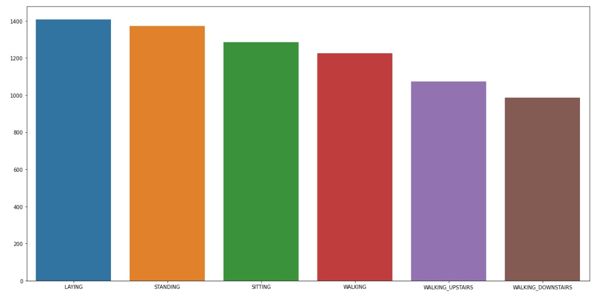
```


Hedef değişken; Yatma(0), Ayakta Durma (1), Oturma(2), Yürüme(3), Merdiven Çıkma(4), Merdiven İnme(5) olmak üzere 6 farklı kategoriye sahiptir. \@ref(fig:freq).’ de hedef değişkene göre gözlem sayıları görselleştirilmiştir.


```{r tbodyaccmagplot, echo=FALSE, out.width="100%",out.height="45%" , fig.cap="Sabit ve hareketli aktiviteler için tBodyAccMagmean değişkeninin yoğunluk grafiği"}
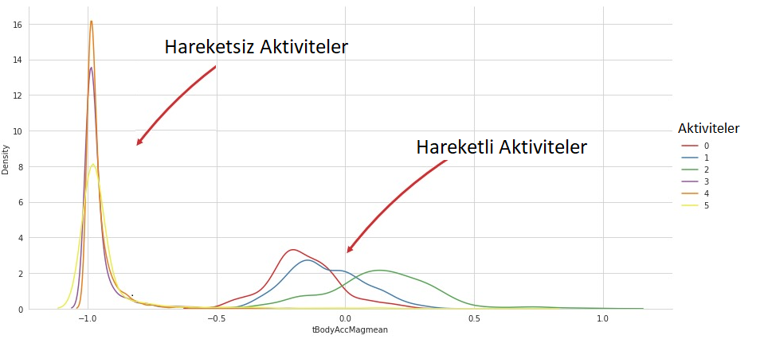
```


\@ref(fig:tbodyaccmagplot). Veri setindeki 'tBodyAccMagmean' değişkeninin yoğunluk grafiğidir.Aktiviteler, farklı renklerde gösterilmiş.Grafiğin sol tarafında "Sabit Aktiviteler" olarak adlandırılan Uzanma, Ayakta durma, Oturma, sağ tarafındaki ise "Hareketli Aktiviteler" olarak adlandırılan Yürüme, Merdiven inme, Merdiven çıkma aktivitelerini temsil etmektedir.


```{r tbodyaccmagplot2, echo=FALSE, out.width="100%",out.height="45%" , fig.cap="Sabit ve hareketli aktivitelerin yoğunluk grafiklerinin karşılaştırılması"}
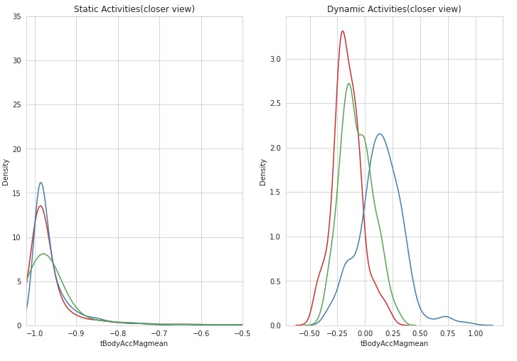
```


\@ref(fig:tbodyaccmagplot2). 'tBodyAccMagmean' değişkeninin aktivitelere göre ayrılmış ve  yakınlaştırılmış  yoğunluk grafikleridir. İlk grafik, "Oturma", "Ayakta durma" ve "Yatma" aktivitelerini içerir ve yatay eksen, "-1.02" ile "-0.5" arasında bir aralığı kapsar.İkinci grafik ise "Yürüme", "Aşağı inme" ve "Yukarı çıkma" aktivitelerini içerir ve yine yatay eksen aynı aralıkta kısıtlanmıştır.Her iki grafik de, aktivitelerin ayrı ayrı dağılımlarını farklı renklerle gösterir ve dağılımların şekli hakkında bilgi sağlar.Bu grafiği oluşturmak için seaborn kütüphanesi kullanılmıştır.


```{r boxplot, echo=FALSE, out.width="100%",out.height="45%" , fig.cap="tBodyAccMagmean Değişkeninin Aktivitilere Göre BoxPlot Grafiği"}
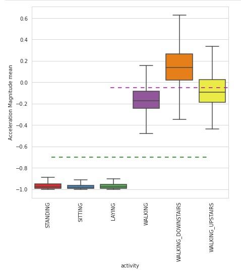
```


\@ref(fig:boxplot). Her bir aktivitenin ortalama ivme büyüklüğünün dağılımını gösterir. Kesik çizgiler, değişkenin değerinin belirli bir eşiğin altında veya üstünde olma durumlarını gösterir. 'y=- 0.7' çizgisi, sabit haldeki aktiviteler için eşiği temsil ederken, 'y=- 0.05' çizgisi, hareket halindeki aktiviteler için eşiği temsil eder. Plt.axhline() fonksiyonu içerisindeki 'dashes' parametresi, çizgilerin kesikli görüntüsünü sağlar. Bu grafiği oluşturmak için seaborn kütüphanesindeki fonksiyonlar kullanılmıştır. Aşağıdaki kurallar verideki tBodyAccMagmean değişkeninin aldığı değerlere göre aktivitelerin gruplanmasını göstermektedir;

-	Eğer -0.8 > tBodyAccMagmean > -1  ise , sabit aktivite (ayakta, oturuyor veya uzanıyor) olarak değerlendirilebilir.
-	Eğer -0.6 < tBodyAccMagmean < 0.7 ise, hareketli aktivite (yürüyor, merdivenlerden aşağı iniyor ya da merdivenlerden yukarı çıkıyor) olarak değerlendirilebilir.

Araştırma çok sınıflı sınıflama problemi olarak ele alındığında makine öğrenmesi yöntemleri ile sınıflandırma modelleri geliştirilmesi gereklidir.


## Çok Sınıflı (Multiclass) Sınıflama Problemi
Bu çalışmada akıllı telefon sensörleri ile elde edilen insan aktivitelerinin sınıflandırması Rassal Ormanlar , XGBoost, Destek Vektör Makinesi (SVM), K-En Yakın Komşuluk Modeli (KNN), Yapay Sinir Ağları yöntemleri kullanılmıştır. İlk olarak orijinal verilerdeki altı aktivite (Yürüme, Yukarı çıkma, Aşağı inme, Oturma, Ayakta, Yatma) için sınıflandırma hedeflenmiştir. Bölüm 3.1’de bu problem için farklı modeller ile elde edilen sonuçlara yer verilmiştir. Uygulamada Python programlama dili kullanılmış ve Scikit-Learn (Buitinck ve diğerleri, 2013), Pandas, Numpy, Matplotlib,LazyClassifier, SVM, XGBoost, KNeighborsClassifier Tensorflow, Keras kütüphanelerinden yararlanılmıştır.Modellerin performanslarını değerlendirmek üzere kesinlik, duyarlılık, F1-skoru, doğruluk oranı, dengelenmiş doğruluk oranı hesaplanmıştır.

Üç ayrı değişken grubu kullanılarak modellemeler yapılmıştır:

- Jiroskop Sensörüne Ait Değişkenler İle Modelleme
- İvme Ölçer Sensörüne Ait Değişkenler İle Modelleme
- Jiroskop ve İvme Ölçer Sensörlerine Ait Değişkenler İle Modelleme

Sensörlerin ayrı ayrı ve birlikte kullanılmasının modellerin performansına etkisi araştırılmıştır.

Table: (\#tab:nvar) Jiroskop ve İvme Ölçer Sensörlerinden elde edilen değişkenler

Değişkenler               Elde edilen değişken sayısı
------------------------- ----------------------------
fBodyGyro                 79                
fBodyAcc                  79
fBodyAccJerk              79                
tBodyAcc                  40
tBodyAccJerk              40      
tBodyGyro                 40
tBodyGyroJerk             40
tGravityAcc               40
fBodyGyroJerkMag          13
fBodyGyroMag              13
fBodyAccJerkMag           13
fBodyAccMag               13
tBodyGyroJerkMag          13
tBodyGyroMag              13
tBodyAccJerkMag           13
tGravityAccMag            13
tBodyAccMag               13
angle                     7

Table: (\#tab:nvargyro) Sadece Jiroskop Sensöründen elde edilen Değişkenler

Değişkenler               Elde edilen değişken sayısı
------------------------- ----------------------------
fBodyGryo                 79
tBodyGyro                 40
tBodyGyroJerk             40
tBodyGyroMag              13
tBodyGyroJerkMag          13
fBodyGyroMag              13
fBodyGyroJerkMag          13
angle                     5

Table: (\#tab:nvaracc) Sadece İvmeölçer Sensöründen elde edilen Değişkenler

Değişkenler               Elde edilen değişken sayısı
------------------------- ----------------------------
fBodyAcc                  79
fBodyAccJerk              79
tBodyAcc                  40
tGravityAcc               40
tBodyAccJerk              40
tBodyAccMag               13
tGravityAccMag            13
tBodyAccJerkMag           13
fBodyAccMag               13
fBodyAccJerkMag           13
angle                     5


## Jiroskop Sensörüne Ait Değişkenler İle Modelleme

### KNN Modeli
Bu bölümde jiroskop sensöründen elde edilen veriler kullanılmıştır.K-En yakın komşuluk modeli kurulmuş ve çıktıları değerlendirilmiştir. 
\@ref(tab:nvargyro).’ te belirtilen değişkenler kullanılarak modelleme gerçekleştirilmiştir.


#### Hiper Parametre Seçimi
Daha önce belirlenen parametre uzayını ve Scikit-Learn kütüphanesinde bulunan GridSearchCV algoritması ile en yüksek doğruluk oranı yakalanana kadar çalışması sağlanmıştır.
K-En yakın komşuluk modeli için en yüksek doğruluk oranı aşağıdaki parametreler ile bulunmuştur; 

- 'metric': 'manhattan'
-	'n_neighbors': 9 
-	'weights': 'distance'

#### En İyi Model 
Bulunan parametrelerle kurulan modelin sınıflandırma metrikleri aşağıdaki gibidir.

Table: (\#tab:jknn) Jiroskop Sensöründen elde edilen değişkenler ile kurulan k en yakın komşular modelinin başarı sonuçları

                precision  recall     F1-score   support
-----------     ---------- ---------- ---------- ----------
0               0.70       0.84       0.77        496
1               0.86       0.75       0.80        471
2               0.76       0.71       0.74        420
3               0.82       0.75       0.78        491
4               0.79       0.89       0.84        531
5               1.00       0.95       0.97        537
Accuracy                              0.82        2946
macro avg       0.82       0.81       0.82        2946
weighted avg    0.83       0.82       0.82        2946


```{r knnconf, fig.align='center',echo=FALSE, out.width="90%",out.height="35%" , fig.cap="K-NN Modeli Karmaşıklık Matrisi"}
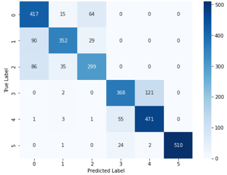
```

```{r knntesttrain,fig.align='center', echo=FALSE, out.width="60%",out.height="25%" , fig.cap="K-NN Modelinin Eğitim ve Test Verilerinin Başarı Performansları"}
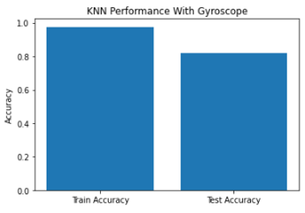
```

### Rassal Ormanlar Modeli
Bu bölümde jiroskop sensöründen elde edilen veriler kullanılmıştır.Rassal ormanlar modeli kurulmuş ve çıktıları değerlendirilmiştir. 
\@ref(tab:nvargyro).’ te belirtilen değişkenler kullanılarak modelleme işlemi gerçekleştirilmiştir.


#### Hiper Parametre Seçimi 
Daha önce belirlenen parametre uzayını ve Scikit-Learn kütüphanesinde bulunan GridSearchCV algoritması ile en yüksek doğruluk oranı yakalanana kadar çalışması sağlanmıştır.

-	max_depth: 20
-	min_samples_leaf: 4
-	min_samples_split: 10
-	n_estimators: 500

#### En İyi Model 
Bulunan parametrelerle kurulan modelin sınıflandırma metrikleri aşağıdaki gibidir.


Table: (\#tab:jrf) Jiroskop Sensöründen elde edilen değişkenler ile kurulan rassal ormanlar modelinin başarı sonuçları

                precision  recall     F1-score   support
-----------     ---------- ---------- ---------- ----------
0               0.89       0.85       0.87        496
1               0.89       0.94       0.92        471
2               0.81       0.81       0.81        420
3               0.97       0.88       0.92        491
4               0.90       0.97       0.93        531
5               1.00       1.00       1.00        537
Accuracy                              0.91        2946
macro avg       0.91       0.81       0.91        2946
weighted avg    0.91       0.82       0.91        2946


```{r randomforestconfmat, fig.align='center', echo=FALSE, out.width="90%",out.height="35%" , fig.cap="Rassal Ormanlar Modeli Karmaşıklık Matrisi"}
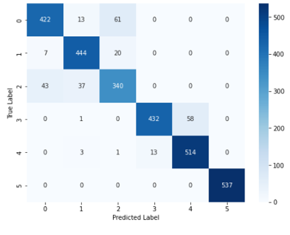
```


```{r randomforesttesttrain, fig.align='center', echo=FALSE, out.width="60%",out.height="25%" , fig.cap="Rassal Ormanlar Modelinin Eğitim ve Test Verilerinin Başarı Performansları"}
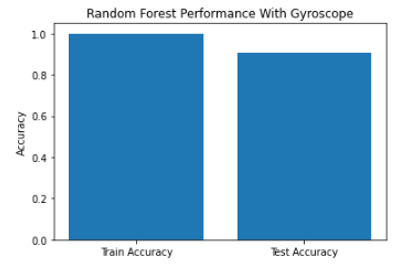
```

\newpage
### eXtreme Gradient Boosting (XGBoost)
Bu bölümde jiroskop sensöründen elde edilen veriler kullanılmıştır.XGBoost modeli kurulmuş ve çıktıları değerlendirilmiştir. 
\@ref(tab:nvargyro).’ te belirtilen değişkenler kullanılarak modelleme işlemi gerçekleştirilmiştir.

#### Hiper Parametre Seçimi
Daha önce belirlenen parametre uzayını ve Scikit-Learn kütüphanesinde bulunan GridSearchCV algoritması ile en yüksek doğruluk oranı yakalanana kadar çalışması sağlanmıştır.

- max_depth: 3
- learning_rate:  0.01
- n_estimators: 100

#### En İyi Model
Bulunan parametrelerle kurulan modelin sınıflandırma metrikleri aşağıdaki gibidir.

Table: (\#tab:jxgboost) Jiroskop Sensöründen elde edilen değişkenler ile kurulan xgboost modelinin başarı sonuçları

                precision  recall     F1-score   support
-----------     ---------- ---------- ---------- ----------
0               0.91       0.84       0.87        496
1               0.84       0.90       0.87        471
2               0.81       0.83       0.82        420
3               0.94       0.86       0.90        491
4               0.88       0.94       0.91        531
5               1.00       1.00       1.00        537
Accuracy                              0.90        2946
macro avg       0.90       0.89       0.89        2946
weighted avg    0.90       0.90       0.90        2946


```{r xgboostconfmat, fig.align='center', echo=FALSE, out.width="90%",out.height="35%" , fig.cap="XGBoost Modeli Karmaşıklık Matrisi"}

```


```{r xgboosttesttrain, fig.align='center', echo=FALSE, out.width="60%",out.height="25%" , fig.cap="XGBoost Modelinin Eğitim ve Test Verilerinin Başarı Performansları"}
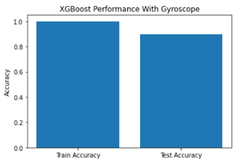
```

### Destek Vektör Makinesi
Bu bölümde jiroskop sensöründen elde edilen veriler kullanılmıştır.Destek Vektör Makinesi (SVM) modeli kurulmuş ve çıktıları değerlendirilmiştir
\@ref(tab:nvargyro).’ te belirtilen değişkenler kullanılarak modelleme işlemi gerçekleştirilmiştir.

#### Hiper Parametre Seçimi
Daha önce belirlenen parametre uzayını ve Scikit-Learn kütüphanesinde bulunan GridSearchCV algoritması ile en yüksek doğruluk oranı yakalanana kadar çalışması sağlanmıştır.

- C: 0.1
- gamma: 0.01
- kernel: linear

#### En İyi Model
Bulunan parametrelerle kurulan modelin sınıflandırma metrikleri aşağıdaki gibidir.

Table: (\#tab:jsvm) Jiroskop Sensöründen elde edilen değişkenler ile kurulan destek vektör makinası modelinin başarı sonuçları

                precision  recall     F1-score   support
-----------     ---------- ---------- ---------- ----------
0               0.86       0.89       0.88        496
1               0.94       0.94       0.94        471
2               0.83       0.83       0.83        420
3               0.92       0.88       0.90        491
4               0.90       0.92       0.91        531
5               1.00       1.00       1.00        537
Accuracy                              0.91        2946
macro avg       0.91       0.91       0.91        2946
weighted avg    0.91       0.91       0.91        2946


```{r svmconfmat, fig.align='center', echo=FALSE, out.width="90%",out.height="35%" , fig.cap="Destek Vektör Makinesi Modeli Karmaşıklık Matrisi"}

```


```{r svmtesttrain, fig.align='center', echo=FALSE, out.width="60%",out.height="25%" , fig.cap="Destek Vektör Modelinin Eğitim ve Test Verilerinin Başarı Performansları"}
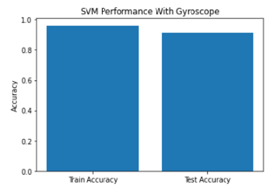
```


### Yapay Sinir Ağları (Neural Networks)
Bu bölümde jiroskop sensörü üzerinde yapay sinir ağları modeli kullanılmış ve çıktıları değerlendirilmiştir.Tensorflow ve Keras kütüphanelerindeki Sequential() fonksiyonu kullanılmıştır.

#### Kullanılan Katmanlar
İlk katman, tamamen bağlı (Dense) katmandır. Bu katman 64 nörona sahiptir ve girdi boyutu, train veri kümesinin özellik sayısına eşittir. kernel_initializer parametresi "normal" olarak ayarlanmıştır, yani rastgele normal bir dağılım kullanılarak başlangıç ağırlıkları oluşturulacaktır. Bu katmanın aktivasyon fonksiyonu "sigmoid" olarak ayarlanmıştır.
 İkinci katman, bir Dropout katmanıdır. Dropout, ağdaki aşırı uyumu azaltmak için kullanılan bir düzenleme tekniğidir. Bu katmanın Dropout oranı %20 olarak ayarlanmıştır. 
Üçüncü ve son katman, yine bir tamamen bağlı (Dense) katmandır. Bu katman 6 nörona sahiptir ve softmax aktivasyon fonksiyonu kullanılarak çoklu sınıflandırma işlemi gerçekleştirilir. kernel_initializer parametresi "normal" olarak ayarlanmıştır. 
Modelin derlenmesi, "adam" optimizasyon algoritması kullanılarak gerçekleştirilir. Kayıp fonksiyonu “sparse_categorical_crossentropy” olarak ayarlanmıştır, çünkü etiketler doğrudan kategorik olarak kodlanmamıştır. Ölçülen metrik, doğruluk (accuracy) olarak ayarlanmıştır.
\@ref(tab:nvargyro).’ te belirtilen değişkenler kullanılarak modelleme işlemi gerçekleştirilmiştir.


#### En iyi Model
Kullanılan parametrelerle ve belirtilen epochs değeri ile kurulan modelin sınıflandırma metrikleri aşağıdaki gibidir.


Table: (\#tab:jysa) Jiroskop Sensöründen elde edilen değişkenler ile kurulan yapay sinir ağları algoritmasının başarı sonuçları

                precision  recall     F1-score   support
-----------     ---------- ---------- ---------- ----------
0               0.87       0.83       0.85        496
1               0.95       0.96       0.96        471
2               0.80       0.84       0.82        420
3               0.96       0.86       0.91        491
4               0.87       0.96       0.92        531
5               1.00       0.99       0.99        537
Accuracy                              0.91        2946
macro avg       0.91       0.91       0.91        2946
weighted avg    0.91       0.91       0.91        2946


```{r ysaconfmat, fig.align='center', echo=FALSE, out.width="90%",out.height="35%" , fig.cap="Yapay Sinir Ağları Modeli Karmaşıklık Matrisi"}
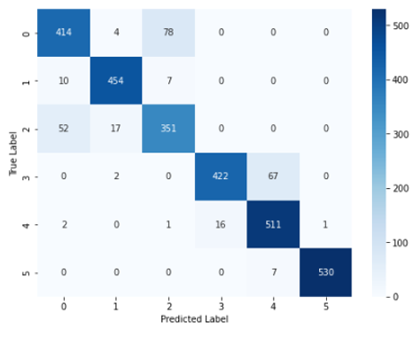
```


```{r ysatesttrain, fig.align='center', echo=FALSE, out.width="60%",out.height="25%" , fig.cap="Jiroskop Sensörü İçin Yapay Sinir Ağları Modelinin Epochs Değerlerine Göre Eğitim ve Test Verilerinin Başarı Performansları"}
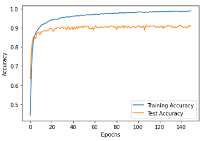
```

## İvme Ölçer Sensörüne Ait Değişkenler İle Modelleme

### K-En Yakın Komşuluk Modeli
Bu bölümde ivme ölçer sensöründen elde edilen veriler kullanılmıştır.K-En yakın komşuluk modeli kurulmuş ve çıktıları değerlendirilmiştir. 
\@ref(tab:nvaracc).’ te belirtilen değişkenler kullanılarak modelleme gerçekleştirilmiştir.

#### Hiper Parametre Seçimi
Daha önce belirlenen parametre uzayını ve Scikit-Learn kütüphanesinde bulunan GridSearchCV algoritması ile en yüksek doğruluk oranı yakalanana kadar çalışması sağlanmıştır.
K-En yakın komşuluk modeli için en yüksek doğruluk oranı aşağıdaki parametreler ile bulunmuştur;

-	metric: manhattan
-	n_neighbors: 9 
-	weights: distance

#### En İyi Model 
Bulunan parametrelerle kurulan modelin sınıflandırma metrikleri aşağıdaki gibidir.

Table: (\#tab:iknn) İvmeölçer Sensöründen elde edilen değişkenler ile kurulan k en yakın komşular algoritmasının başarı sonuçları

                precision  recall     F1-score   support
-----------     ---------- ---------- ---------- ----------
0               0.89       0.85       0.87        496
1               0.89       0.94       0.92        471
2               0.81       0.81       0.81        420
3               0.97       0.88       0.92        491
4               0.90       0.97       0.93        531
5               1.00       1.00       1.00        537
Accuracy                              0.91        2946
macro avg       0.91       0.91       0.91        2946
weighted avg    0.91       0.91       0.91        2946

```{r iknnconfmat, fig.align='center', echo=FALSE, out.width="90%",out.height="35%" , fig.cap="K-NN Modeli Karmaşıklık Matrisi"}
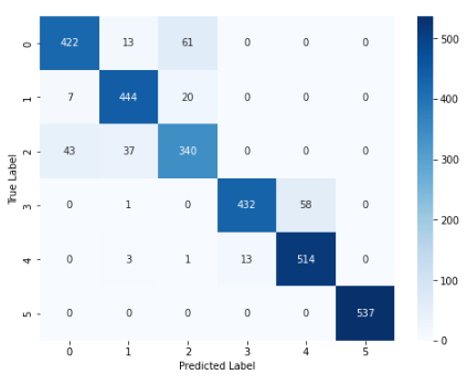
```


```{r iknntesttrain, fig.align='center', echo=FALSE, out.width="60%",out.height="25%" , fig.cap="K-NN Modelinin Eğitim ve Test Verilerinin Başarı Performansları"}
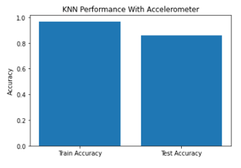
```

### Rassal Ormanlar Modeli
Bu bölümde ivme ölçer sensöründen elde edilen veriler kullanılmıştır.Rassal ormanlar modeli kurulmuş ve çıktıları değerlendirilmiştir. 
\@ref(tab:nvaracc).’ te belirtilen değişkenler kullanılarak modelleme işlemi gerçekleştirilmiştir.

#### Hiper Parametre Seçimi 
Daha önce belirlenen parametre uzayını ve Scikit-Learn kütüphanesinde bulunan GridSearchCV algoritması ile en yüksek doğruluk oranı yakalanana kadar çalışması sağlanmıştır.

-	max_depth: 20
-	min_samples_leaf: 4
-	min_samples_split: 10
-	n_estimators: 500

#### En İyi Model
Bulunan parametrelerle kurulan modelin sınıflandırma metrikleri aşağıdaki gibidir.

Table: (\#tab:irf) İvmeölçer Sensöründen elde edilen değişkenler ile kurulan rassal ormanlar modelinin başarı sonuçları

                precision  recall     F1-score   support
-----------     ---------- ---------- ---------- ----------
0               0.85       0.96       0.90        496
1               0.88       0.86       0.87        471
2               0.95       0.94       0.89        420
3               0.81       0.81       0.81        491
4               0.82       0.83       0.83        531
5               1.00       1.00       1.00        537
Accuracy                              0.88        2946
macro avg       0.89       0.88       0.88        2946
weighted avg    0.89       0.88       0.88        2946


```{r irandomforestconfmat, fig.align='center', echo=FALSE, out.width="90%",out.height="35%" , fig.cap="Rassal Ormanlar Modeli Karmaşıklık Matrisi"}
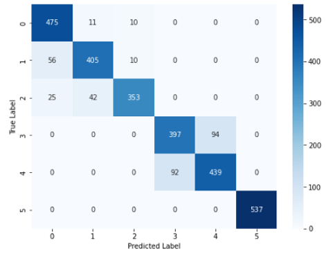
```


```{r irandomforesttesttrain, fig.align='center', echo=FALSE, out.width="60%",out.height="25%" , fig.cap="Rassal Ormanlar Modelinin Eğitim ve Test Verilerinin Başarı Performansları"}
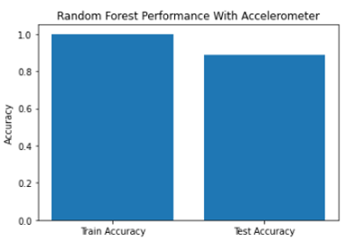
```

### eXtreme Gradient Boosting (XGBoost)

Bu bölümde ivme ölçer sensöründen elde edilen veriler kullanılmıştır.XGBoost modeli kurulmuş ve çıktıları değerlendirilmiştir. 
\@ref(tab:nvaracc).’ te belirtilen değişkenler kullanılarak modelleme işlemi gerçekleştirilmiştir.


#### Hiper Parametre Seçimi

Daha önce belirlenen parametre uzayını ve Scikit-Learn kütüphanesinde bulunan GridSearchCV algoritması ile en yüksek doğruluk oranı yakalanana kadar çalışması sağlanmıştır.

- max_depth: 3
- learning_rate:  0.01
- n_estimators: 100


#### En İyi Model

Bulunan parametrelerle kurulan modelin sınıflandırma metrikleri aşağıdaki gibidir.


Table: (\#tab:ixgboost) İvmeölçer Sensöründen elde edilen değişkenler ile kurulan xgboost modelinin başarı sonuçları

                precision  recall     F1-score   support
-----------     ---------- ---------- ---------- ----------
0               0.88       0.95       0.91        496
1               0.87       0.89       0.88        471
2               0.98       0.89       0.93        420
3               0.82       0.80       0.81        491
4               0.82       0.83       0.83        531
5               1.00       1.00       1.00        537
Accuracy                              0.89        2946
macro avg       0.90       0.89       0.89        2946
weighted avg    0.89       0.89       0.89        2946


```{r ixgboostconfmat, fig.align='center', echo=FALSE, out.width="90%",out.height="35%" , fig.cap="Xgboost modeli Karmaşıklık Matrisi"}
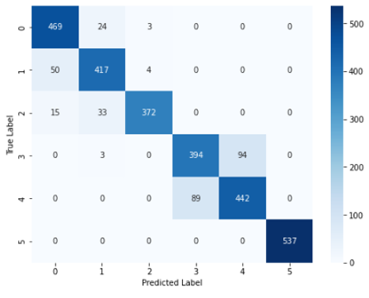
```


```{r ixgboosttesttrain, fig.align='center', echo=FALSE, out.width="60%",out.height="25%" , fig.cap="Xgboost Modelinin Eğitim ve Test Verilerinin Başarı Performansları"}
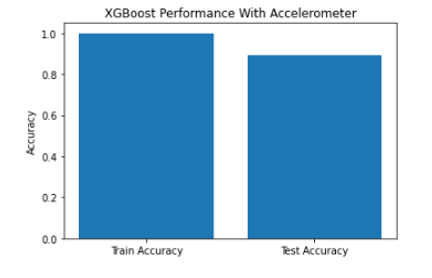
```


### Destek Vektör Makinesi

Bu bölümde ivme ölçer sensöründen elde edilen veriler kullanılmıştır.Destek Vektör Makinesi (SVM) modeli kurulmuş ve çıktıları değerlendirilmiştir
\@ref(tab:nvaracc).’ te belirtilen değişkenler kullanılarak modelleme işlemi gerçekleştirilmiştir.

#### Hiper Parametre Seçimi 
Daha önce belirlenen parametre uzayını ve Scikit-Learn kütüphanesinde bulunan GridSearchCV algoritması ile en yüksek doğruluk oranı yakalanana kadar çalışması sağlanmıştır.

- C: 0.1
- gamma: 0.01
- kernel: linear

#### En İyi Model

Bulunan parametrelerle kurulan modelin sınıflandırma metrikleri aşağıdaki gibidir.


Table: (\#tab:isvm) İvmeölçer Sensöründen elde edilen değişkenler ile kurulan destek vektör makinası algoritmasının başarı sonuçları

                precision  recall     F1-score   support
-----------     ---------- ---------- ---------- ----------
0               0.89       0.96       0.92        496
1               0.90       0.90       0.90        471
2               0.98       0.90       0.94        420
3               0.86       0.77       0.81        491
4               0.81       0.88       0.84        531
5               1.00       1.00       1.00        537
Accuracy                              0.90        2946
macro avg       0.91       0.90       0.90        2946
weighted avg    0.91       0.90       0.90        2946


```{r isvmconfmat, fig.align='center', echo=FALSE, out.width="90%",out.height="35%" , fig.cap="Destek Vektör Makinesi Modeli Karmaşıklık Matrisi"}
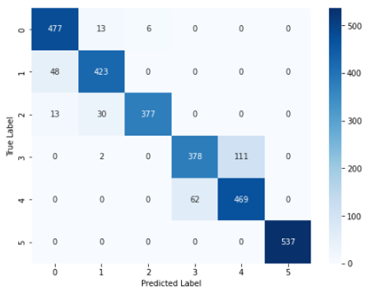
```


```{r isvmtesttrain, fig.align='center', echo=FALSE, out.width="60%",out.height="25%" , fig.cap="Destek Vektör Modelinin Eğitim ve Test Verilerinin Başarı Performansları"}
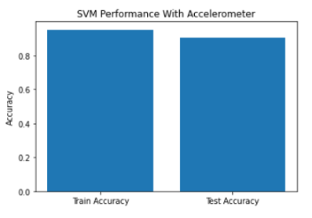
```

### Yapay Sinir Ağları (Neural Networks)
Bu bölümde ivme ölçer sensörü üzerinde yapay sinir ağları modeli kullanılmış ve çıktıları değerlendirilmiştir.Tensorflow ve Keras kütüphanelerindeki Sequential() fonksiyonu kullanılmıştır.

#### Kullanılan Katmanlar

İlk katman, tamamen bağlı (Dense) katmandır. Bu katman 64 nörona sahiptir ve girdi boyutu, train veri kümesinin özellik sayısına eşittir. kernel_initializer parametresi "normal" olarak ayarlanmıştır, yani rastgele normal bir dağılım kullanılarak başlangıç ağırlıkları oluşturulacaktır. Bu katmanın aktivasyon fonksiyonu "sigmoid" olarak ayarlanmıştır.
 İkinci katman, bir Dropout katmanıdır. Dropout, ağdaki aşırı uyumu azaltmak için kullanılan bir düzenleme tekniğidir. Bu katmanın Dropout oranı %20 olarak ayarlanmıştır. 
Üçüncü ve son katman, yine bir tamamen bağlı (Dense) katmandır. Bu katman 6 nörona sahiptir ve softmax aktivasyon fonksiyonu kullanılarak çoklu sınıflandırma işlemi gerçekleştirilir. kernel_initializer parametresi "normal" olarak ayarlanmıştır. 
Modelin derlenmesi, "adam" optimizasyon algoritması kullanılarak gerçekleştirilir. Kayıp fonksiyonu “sparse_categorical_crossentropy” olarak ayarlanmıştır, çünkü etiketler doğrudan kategorik olarak kodlanmamıştır. Ölçülen metrik, doğruluk (accuracy) olarak ayarlanmıştır.
\@ref(tab:nvaracc).’ te belirtilen değişkenler kullanılarak modelleme işlemi gerçekleştirilmiştir.


#### En iyi Model

Kullanılan parametrelerle ve belirtilen epochs değeri ile kurulan modelin sınıflandırma metrikleri aşağıdaki gibidir.


Table: (\#tab:iysa) İvmeölçer Sensöründen elde edilen değişkenler ile kurulan yapay sinir ağları modelinin başarı sonuçları

                precision  recall     F1-score   support
-----------     ---------- ---------- ---------- ----------
0               0.89       0.98       0.93        496
1               0.95       0.87       0.91        471
2               0.98       0.95       0.97        420
3               0.85       0.81       0.83        491
4               0.82       0.86       0.84        531
5               1.00       0.97       0.99        537
Accuracy                              0.91        2946
macro avg       0.91       0.91       0.91        2946
weighted avg    0.91       0.91       0.91        2946


```{r iysaconfmat, fig.align='center', echo=FALSE, out.width="90%",out.height="35%" , fig.cap="Yapay Sinir Ağları Modeli Karmaşıklık Matrisi"}
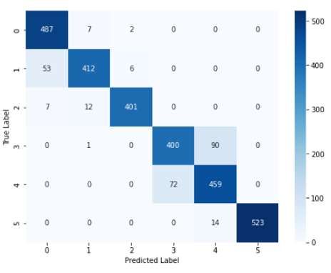
```


```{r iysatesttrain, fig.align='center', echo=FALSE, out.width="60%",out.height="25%" , fig.cap="İvme Ölçer Sensörü İçin Yapay Sinir Ağları Modelinin Epochs Değerlerine Göre Eğitim ve Test Verilerinin Başarı Performansları"}
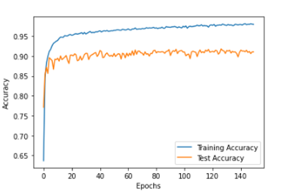
```


## Jiroskop ve İvme Ölçer Sensörlerine Ait Değişkenler İle Modelleme

### K-En Yakın Komşuluk Modeli

Bu bölümde jiroskop ve ivme ölçer sensörlerinden elde edilen veriler kullanılmıştır.K-En yakın komşuluk modeli kurulmuş ve çıktıları değerlendirilmiştir. 
\@ref(tab:nvar).’ te belirtilen değişkenler kullanılarak modelleme gerçekleştirilmiştir.

#### Hiper Parametre Seçimi

Daha önce belirlenen parametre uzayını ve Scikit-Learn kütüphanesinde bulunan GridSearchCV algoritması ile en yüksek doğruluk oranı yakalanana kadar çalışması sağlanmıştır.
K-En yakın komşuluk modeli için en yüksek doğruluk oranı aşağıdaki parametreler ile bulunmuştur; 

-	'metric': 'manhattan'
-	'n_neighbors': 9 
-	'weights': 'distance'


#### En İyi Model 
Bulunan parametrelerle kurulan modelin sınıflandırma metrikleri aşağıdaki gibidir.


Table: (\#tab:jiknn) Jiroskop ve İvmeölçer Sensörlerinden elde edilen değişkenler ile kurulan k en yakın komşular modelinin başarı sonuçları

                precision  recall     F1-score   support
-----------     ---------- ---------- ---------- ----------
0               0.87       0.98       0.92        496
1               0.88       0.92       0.90        471
2               0.98       0.78       0.87        420
3               0.96       0.82       0.89        491
4               0.86       0.97       0.91        531
5               1.00       1.00       1.00        537
Accuracy                              0.92        2946
macro avg       0.92       0.91       0.91        2946
weighted avg    0.92       0.92       0.92        2946


```{r jiknnconfmat, fig.align='center', echo=FALSE, out.width="90%",out.height="35%" , fig.cap="K-NN Modeli Karmaşıklık Matrisi"}
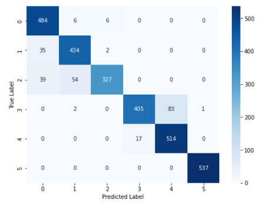
```


```{r jiknntesttrain, fig.align='center', echo=FALSE, out.width="60%",out.height="25%" , fig.cap="K-NN Modelinin Eğitim ve Test Verilerinin Başarı Performansları"}
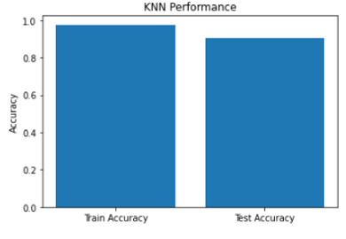
```

### Rassal Ormanlar Modeli

Bu bölümde jiroskop ve ivme ölçer sensörlerinden elde edilen veriler kullanılmıştır.Rassal ormanlar modeli kurulmuş ve çıktıları değerlendirilmiştir. \@ref(tab:nvar).’ te belirtilen değişkenler kullanılarak modelleme işlemi gerçekleştirilmiştir.

#### Hiper Parametre Seçimi 

Daha önce belirlenen parametre uzayını ve Scikit-Learn kütüphanesinde bulunan GridSearchCV algoritması ile en yüksek doğruluk oranı yakalanana kadar çalışması sağlanmıştır.

-	max_depth: 20
-	min_samples_leaf: 4
-	min_samples_split: 10
-	n_estimators: 500

#### En İyi Model 

Bulunan parametrelerle kurulan modelin sınıflandırma metrikleri aşağıdaki gibidir.

Table: (\#tab:jirf) Jiroskop ve İvmeölçer Sensörlerinden elde değişkenler ile kurulan rassal ormanlar modelinin başarı sonuçları

                precision  recall     F1-score   support
-----------     ---------- ---------- ---------- ----------
0               0.90       0.97       0.93        496
1               0.89       0.92       0.91        471
2               0.96       0.84       0.89        420
3               0.91       0.88       0.90        491
4               0.90       0.92       0.91        531
5               1.00       1.00       1.00        537
Accuracy                              0.93        2946
macro avg       0.93       0.92       0.92        2946
weighted avg    0.93       0.93       0.93        2946


```{r jirandomforestconfmat, fig.align='center', echo=FALSE, out.width="90%",out.height="35%" , fig.cap="Rassal Ormanlar Modeli Karmaşıklık Matrisi"}
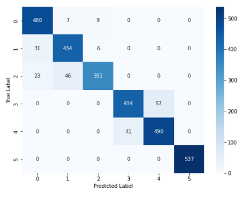
```


```{r jirandomforesttesttrain, fig.align='center', echo=FALSE, out.width="60%",out.height="25%" , fig.cap="Rassal Ormanlar Modelinin Eğitim ve Test Verilerinin Başarı Performansları"}
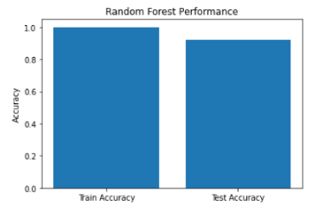
```

### eXtreme Gradient Boosting (XGBoost)
Bu bölümde jiroskop ve ivme ölçer sensörlerinden elde edilen veriler kullanılmıştır.XGBoost modeli kurulmuş ve çıktıları değerlendirilmiştir. \@ref(tab:nvar).’ te belirtilen değişkenler kullanılarak modelleme işlemi gerçekleştirilmiştir.


#### Hiper Parametre Seçimi

Daha önce belirlenen parametre uzayını ve Scikit-Learn kütüphanesinde bulunan GridSearchCV algoritması ile en yüksek doğruluk oranı yakalanana kadar çalışması sağlanmıştır.

- max_depth: 3
- learning_rate:  0.01
- n_estimators: 100

#### En İyi Model

Bulunan parametrelerle kurulan modelin sınıflandırma metrikleri aşağıdaki gibidir.

Table: (\#tab:jixgboost) Jiroskop ve İvmeölçer Sensörlerinden elde edilen değişkenler ile kurulan xgboost modelinin başarı sonuçları

                precision  recall     F1-score   support
-----------     ---------- ---------- ---------- ----------
0               0.85       0.90       0.88        496
1               0.85       0.76       0.80        471
2               0.88       0.88       0.88        420
3               0.88       0.82       0.85        491
4               0.80       0.92       0.85        531
5               1.00       0.97       0.99        537
Accuracy                              0.87        2946
macro avg       0.88       0.87       0.87        2946
weighted avg    0.88       0.87       0.87        2946


```{r jixgboostconfmat, fig.align='center', echo=FALSE, out.width="90%",out.height="35%" , fig.cap="XGBoost Modeli Karmaşıklık Matrisi"}
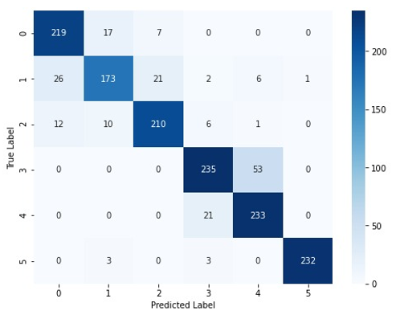
```


```{r jixgboosttesttrain, fig.align='center', echo=FALSE, out.width="60%",out.height="25%" , fig.cap="XGBoost Modelinin Eğitim ve Test Verilerinin Başarı Performansları"}
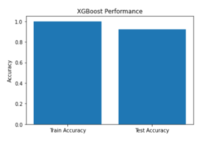
```

### Destek Vektör Makinesi

Bu bölümde jiroskop ve ivme ölçer sensörlerinden elde edilen veriler kullanılmıştır.Destek Vektör Makinesi (SVM) modeli kurulmuş ve çıktıları değerlendirilmiştir
\@ref(tab:nvar).’ te belirtilen değişkenler kullanılarak modelleme işlemi gerçekleştirilmiştir.

#### Hiper Parametre Seçimi 

Daha önce belirlenen parametre uzayını ve Scikit-Learn kütüphanesinde bulunan GridSearchCV algoritması ile en yüksek doğruluk oranı yakalanana kadar çalışması sağlanmıştır.

- C: 0.1
- gamma: 0.01
- kernel: linear

#### En İyi Model

Bulunan parametrelerle kurulan modelin sınıflandırma metrikleri aşağıdaki gibidir.

Table: (\#tab:jisvm) Jiroskop ve İvmeölçer Sensörlerinden elde edilen değişkenler ile kurulan destek vektör makinesi modelinin başarı sonuçları

                precision  recall     F1-score   support
-----------     ---------- ---------- ---------- ----------
0               0.85       0.87       0.86        496
1               0.86       0.75       0.80        471
2               0.83       0.85       0.84        420
3               0.86       0.82       0.84        491
4               0.78       0.87       0.82        531
5               0.96       0.97       0.97        537
Accuracy                              0.85        2946
macro avg       0.86       0.85       0.85        2946
weighted avg    0.86       0.85       0.85        2946


```{r jisvmconfmat, fig.align='center', echo=FALSE, out.width="90%",out.height="35%" , fig.cap="Destek Vektör Makinesi Modeli Karmaşıklık Matrisi"}
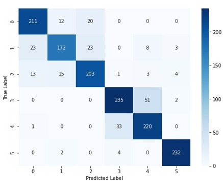
```


```{r jisvmtesttrain, fig.align='center', echo=FALSE, out.width="60%",out.height="25%" , fig.cap="Destek Vektör Modelinin Eğitim ve Test Verilerinin Başarı Performansları"}
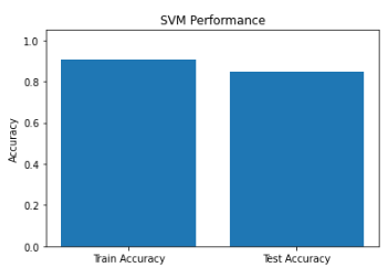
```


### Yapay Sinir Ağları (Neural Networks)

Bu bölümde jiroskop ve ivme ölçer sensörleri üzerinde yapay sinir ağları modeli kullanılmış ve çıktıları değerlendirilmiştir.Tensorflow ve Keras kütüphanelerindeki Sequential() fonksiyonu kullanılmıştır.

#### Kullanılan Katmanlar
İlk katman, tamamen bağlı (Dense) katmandır. Bu katman 64 nörona sahiptir ve girdi boyutu, train veri kümesinin özellik sayısına eşittir. kernel_initializer parametresi "normal" olarak ayarlanmıştır, yani rastgele normal bir dağılım kullanılarak başlangıç ağırlıkları oluşturulacaktır. Bu katmanın aktivasyon fonksiyonu "sigmoid" olarak ayarlanmıştır.
 İkinci katman, bir Dropout katmanıdır. Dropout, ağdaki aşırı uyumu azaltmak için kullanılan bir düzenleme tekniğidir. Bu katmanın Dropout oranı %20 olarak ayarlanmıştır. 
Üçüncü ve son katman, yine bir tamamen bağlı (Dense) katmandır. Bu katman 6 nörona sahiptir ve softmax aktivasyon fonksiyonu kullanılarak çoklu sınıflandırma işlemi gerçekleştirilir. kernel_initializer parametresi "normal" olarak ayarlanmıştır. 
Modelin derlenmesi, "adam" optimizasyon algoritması kullanılarak gerçekleştirilir. Kayıp fonksiyonu “sparse_categorical_crossentropy” olarak ayarlanmıştır, çünkü etiketler doğrudan kategorik olarak kodlanmamıştır. Ölçülen metrik, doğruluk (accuracy) olarak ayarlanmıştır.
\@ref(tab:nvar).’ te belirtilen değişkenler kullanılarak modelleme işlemi gerçekleştirilmiştir.


#### En iyi Model

Kullanılan parametrelerle ve belirtilen epochs değeri ile kurulan modelin sınıflandırma metrikleri aşağıdaki gibidir.

Table: (\#tab:jiysa) Jiroskop ve İvmeölçer Sensörlerinden elde edilen değişkenler ile kurulan yapay sinir ağları modelinin başarı sonuçları

                precision  recall     F1-score   support
-----------     ---------- ---------- ---------- ----------
0               0.93       1.00       0.96        496
1               0.95       0.92       0.93        471
2               0.99       0.94       0.96        420
3               0.95       0.91       0.93        491
4               0.92       0.95       0.94        531
5               1.00       1.00       1.00        537
Accuracy                              0.95        2946
macro avg       0.96       0.95       0.95        2946
weighted avg    0.96       0.95       0.95        2946


```{r jiysaconfmat, fig.align='center', echo=FALSE, out.width="60%",out.height="35%" , fig.cap="Yapay Sinir Ağları Modeli Karmaşıklık Matrisi"}
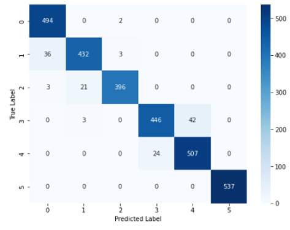
```


```{r jiysatesttrain, fig.align='center', echo=FALSE, out.width="60%",out.height="25%" , fig.cap="Jiroskop ve İvme Ölçer Sensörleri İçin Yapay Sinir Ağları Modelinin Epochs Değerlerine Göre Eğitim ve Test Verilerinin Başarı Performansları"}
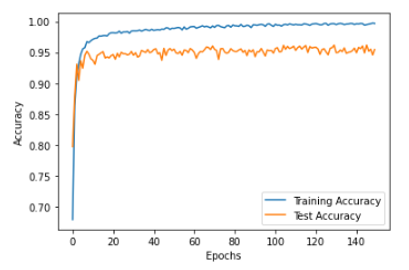
```

